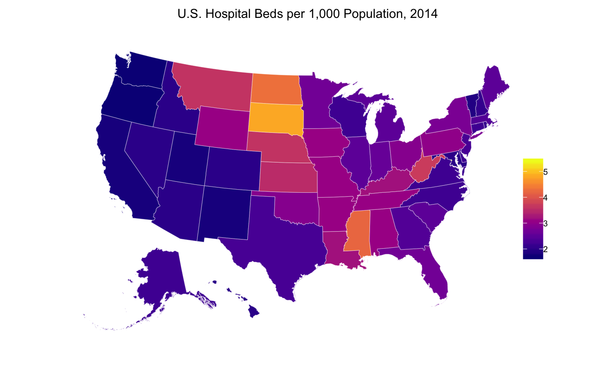

<!-- README.md is generated from README.Rmd. Please edit that file -->

# About `kffdata`

[](https://travis-ci.org/jjchern/kffdata)
[](https://ci.appveyor.com/project/jjchern/kffdata)

The R package `kffdata` stores a few datasets from [the Kaiser Family
Foundation](https://www.kff.org/statedata/) in a tidy format. The
following datasets are currently available:

``` r
kffdata::hosp_beds
kffdata::hosp_admissions
kffdata::hosp_em_visits
kffdata::hosp_ip_days
kffdata::hosp_op_visits
kffdata::hc_eee_pc
kffdata::hc_eee_pc_by_srvu
kffdata::pct_diabetes
kffdata::pct_overweight_obesity
```

# Installation

You can install `kffdata` from the Github repo with

``` r
# install.packages("devtools")
devtools::install_github("jjchern/kffdata@v0.0.1")

# To uninstall the package, use:
# remove.packages("kffdata")
```

# Usage

``` r
library(tidyverse)
#> ── Attaching packages ───────────────────────────────── tidyverse 1.2.1 ──
#> ✔ ggplot2 2.2.1.9000     ✔ purrr   0.2.4     
#> ✔ tibble  1.4.2          ✔ dplyr   0.7.4     
#> ✔ tidyr   0.8.0          ✔ stringr 1.3.0     
#> ✔ readr   1.1.1.9000     ✔ forcats 0.3.0
#> ── Conflicts ──────────────────────────────────── tidyverse_conflicts() ──
#> ✖ dplyr::filter() masks stats::filter()
#> ✖ dplyr::lag()    masks stats::lag()
#> ✖ dplyr::vars()   masks ggplot2::vars()
kffdata::hosp_beds
#> # A tibble: 867 x 8
#>    state   fips  usps  year  for_profit non_profit state_local_gove… total
#>    <chr>   <chr> <chr> <chr>      <dbl>      <dbl>             <dbl> <dbl>
#>  1 Alabama 01    AL    1999       0.700      1.40              1.60   3.70
#>  2 Alabama 01    AL    2000       0.700      1.40              1.50   3.70
#>  3 Alabama 01    AL    2001       0.800      1.40              1.50   3.70
#>  4 Alabama 01    AL    2002       0.800      1.40              1.40   3.60
#>  5 Alabama 01    AL    2003       0.800      1.40              1.30   3.50
#>  6 Alabama 01    AL    2004       0.800      1.30              1.20   3.40
#>  7 Alabama 01    AL    2005       0.800      1.30              0.400  3.40
#>  8 Alabama 01    AL    2006       0.900      0.900             1.50   3.40
#>  9 Alabama 01    AL    2007       0.900      0.900             1.50   3.40
#> 10 Alabama 01    AL    2008       0.900      0.900             1.50   3.30
#> # ... with 857 more rows
kffdata::hosp_admissions
#> # A tibble: 867 x 8
#>    state   fips  usps  year  for_profit non_profit state_local_gove… total
#>    <chr>   <chr> <chr> <chr>      <dbl>      <dbl>             <dbl> <dbl>
#>  1 Alabama 01    AL    1999        26.4       63.5              63.5  153.
#>  2 Alabama 01    AL    2000        31.7       63.2              57.9  153.
#>  3 Alabama 01    AL    2001        31.8       62.2              59.4  153.
#>  4 Alabama 01    AL    2002        32.0       62.3              56.7  151.
#>  5 Alabama 01    AL    2003        36.6       63.1              57.7  157.
#>  6 Alabama 01    AL    2004        37.3       63.4              57.5  158.
#>  7 Alabama 01    AL    2005        37.0       59.5              58.8  155.
#>  8 Alabama 01    AL    2006        40.1       40.4              68.5  149.
#>  9 Alabama 01    AL    2007        39.8       41.6              69.1  150.
#> 10 Alabama 01    AL    2008        37.5       40.2              69.3  147.
#> # ... with 857 more rows
kffdata::hosp_em_visits
#> # A tibble: 867 x 8
#>    state   fips  usps  year  for_profit non_profit state_local_gove… total
#>    <chr>   <chr> <chr> <chr>      <dbl>      <dbl>             <dbl> <dbl>
#>  1 Alabama 01    AL    1999        78.4       174.              199.  451.
#>  2 Alabama 01    AL    2000       102.        172.              192.  465.
#>  3 Alabama 01    AL    2001       101.        154.              184.  439.
#>  4 Alabama 01    AL    2002       108.        174.              201.  483.
#>  5 Alabama 01    AL    2003       116.        168.              192.  476.
#>  6 Alabama 01    AL    2004       107.        158.              183.  448.
#>  7 Alabama 01    AL    2005       114.        156.              188.  459.
#>  8 Alabama 01    AL    2006       133.        118.              227.  345.
#>  9 Alabama 01    AL    2007       121.        129.              237.  366.
#> 10 Alabama 01    AL    2008       122.        127.              236.  486.
#> # ... with 857 more rows
kffdata::hosp_ip_days
#> # A tibble: 867 x 8
#>    state   fips  usps  year  for_profit non_profit state_local_gove… total
#>    <chr>   <chr> <chr> <chr> <chr>      <chr>      <chr>             <chr>
#>  1 Alabama 01    AL    1999  128.4766   324.2993   371.8493          824.…
#>  2 Alabama 01    AL    2000  143.0041   314.0868   348.418           805.…
#>  3 Alabama 01    AL    2001  142.6606   305.3141   351.3807          799.…
#>  4 Alabama 01    AL    2002  151.4114   294.168    278.7336          724.…
#>  5 Alabama 01    AL    2003  169.9235   316.3012   301.3904          787.…
#>  6 Alabama 01    AL    2004  175.6933   319.9925   314.0798          809.…
#>  7 Alabama 01    AL    2005  176.524    304.9451   316.1894          797.…
#>  8 Alabama 01    AL    2006  193        214        368               775  
#>  9 Alabama 01    AL    2007  193        212        362               767  
#> 10 Alabama 01    AL    2008  182        207        364               754  
#> # ... with 857 more rows
kffdata::hosp_op_visits
#> # A tibble: 867 x 8
#>    state   fips  usps  year  for_profit non_profit state_local_gove… total
#>    <chr>   <chr> <chr> <chr>      <dbl>      <dbl>             <dbl> <dbl>
#>  1 Alabama 01    AL    1999        314.       763.              716. 1793.
#>  2 Alabama 01    AL    2000        341.       773.              675. 1789.
#>  3 Alabama 01    AL    2001        345.       707.              691. 1743.
#>  4 Alabama 01    AL    2002        485.       922.              836. 2243.
#>  5 Alabama 01    AL    2003        342.       864.              770. 1976.
#>  6 Alabama 01    AL    2004        330.       816.              680. 1826.
#>  7 Alabama 01    AL    2005        322.       721.              617. 1659.
#>  8 Alabama 01    AL    2006        366.       563.              819. 1748.
#>  9 Alabama 01    AL    2007        355.       590.              824. 1769.
#> 10 Alabama 01    AL    2008        353.       640.              936. 1928.
#> # ... with 857 more rows
kffdata::hc_eee_pc
#> # A tibble: 1,224 x 5
#>    state   fips  usps  year  health_spending_per_capita
#>    <chr>   <chr> <chr> <chr>                      <dbl>
#>  1 Alabama 01    AL    1991                       2535.
#>  2 Alabama 01    AL    1992                       2716.
#>  3 Alabama 01    AL    1993                       2854.
#>  4 Alabama 01    AL    1994                       2991.
#>  5 Alabama 01    AL    1995                       3163.
#>  6 Alabama 01    AL    1996                       3336.
#>  7 Alabama 01    AL    1997                       3540.
#>  8 Alabama 01    AL    1998                       3601.
#>  9 Alabama 01    AL    1999                       3714.
#> 10 Alabama 01    AL    2000                       3932.
#> # ... with 1,214 more rows
kffdata::hc_eee_pc_by_srvu
#> # A tibble: 1,224 x 13
#>    state  fips  usps  year  dental_services home_health_care hospital_care
#>    <chr>  <chr> <chr> <chr>           <dbl>            <dbl>         <dbl>
#>  1 Alaba… 01    AL    1991              98.              62.         1092.
#>  2 Alaba… 01    AL    1992             110.              79.         1201.
#>  3 Alaba… 01    AL    1993             114.             104.         1225.
#>  4 Alaba… 01    AL    1994             121.             118.         1257.
#>  5 Alaba… 01    AL    1995             128.             139.         1345.
#>  6 Alaba… 01    AL    1996             135.             150.         1411.
#>  7 Alaba… 01    AL    1997             143.             150.         1405.
#>  8 Alaba… 01    AL    1998             148.             128.         1379.
#>  9 Alaba… 01    AL    1999             160.             106.         1407.
#> 10 Alaba… 01    AL    2000             170.              99.         1448.
#> # ... with 1,214 more rows, and 6 more variables: medical_durables <dbl>,
#> #   nursing_home_care <dbl>,
#> #   other_health_residential_and_personal_care <dbl>,
#> #   other_professional_services <dbl>,
#> #   physician_and_clinical_services <dbl>,
#> #   prescription_drugs_and_other_medical_nondurables <dbl>
kffdata::pct_diabetes
#> # A tibble: 204 x 8
#>    state   fips  usps  year  no    no_pre_diabetes… yes   yes_pregnancy_r…
#>    <chr>   <chr> <chr> <chr> <chr> <chr>            <chr> <chr>           
#>  1 Alabama 01    AL    2013  0.838 0.014            0.138 0.01            
#>  2 Alabama 01    AL    2014  0.849 0.015            0.129 0.006           
#>  3 Alabama 01    AL    2015  0.845 0.013            0.135 0.008           
#>  4 Alabama 01    AL    2016  0.834 0.011            0.146 0.008           
#>  5 Alaska  02    AK    2013  0.906 0.014            0.071 0.009           
#>  6 Alaska  02    AK    2014  0.904 0.015            0.074 NSD             
#>  7 Alaska  02    AK    2015  0.892 0.01             0.076 NSD             
#>  8 Alaska  02    AK    2016  0.898 0.019            0.075 NSD             
#>  9 Arizona 04    AZ    2013  0.877 0.009            0.107 NSD             
#> 10 Arizona 04    AZ    2014  0.875 0.015            0.1   0.01            
#> # ... with 194 more rows
kffdata::pct_overweight_obesity
#> # A tibble: 204 x 5
#>    state   fips  usps  year  adult_overweight_obesity_rate
#>    <chr>   <chr> <chr> <chr>                         <dbl>
#>  1 Alabama 01    AL    2013                          0.682
#>  2 Alabama 01    AL    2014                          0.670
#>  3 Alabama 01    AL    2015                          0.687
#>  4 Alabama 01    AL    2016                          0.695
#>  5 Alaska  02    AK    2013                          0.661
#>  6 Alaska  02    AK    2014                          0.648
#>  7 Alaska  02    AK    2015                          0.672
#>  8 Alaska  02    AK    2016                          0.667
#>  9 Arizona 04    AZ    2013                          0.618
#> 10 Arizona 04    AZ    2014                          0.640
#> # ... with 194 more rows
```


